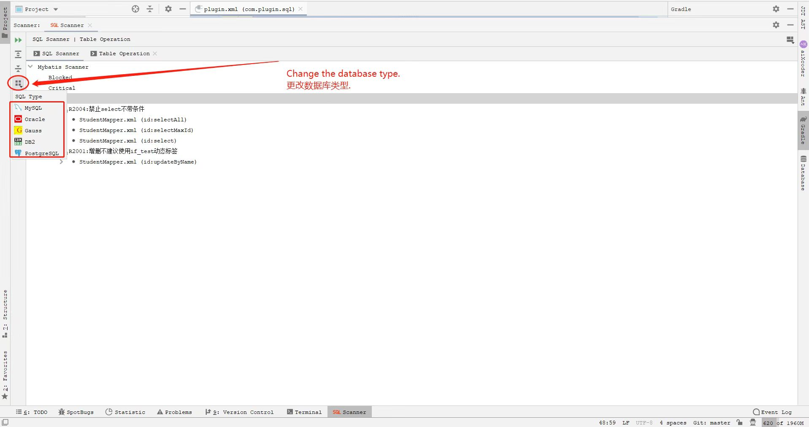

[//]:#DisplayInOneLine

### Java Mybatis SQL Scanner
This plugin can help us to scan mybatis sql xml:  
JetBrains Marketplace:[Java Mybatis SQL Scanner](https://plugins.jetbrains.com/plugin/18661-java-mybatis-sql-scanner/)

Change the database type.
  

turn rules on or off.  
    

这里开源的是idea插件界面，扫描核心方法在jar包 <b>resources/libs</b>.

[Blog](https://zhangxiaofan.blog.csdn.net/)，find more~  
[博客](https://zhangxiaofan.blog.csdn.net/)，发现更多~  

插件开发推荐:  
[idea plugin插件开发1——idea底部窗口(带按钮)](https://zhangxiaofan.blog.csdn.net/article/details/123093013/)  
[idea plugin插件开发2——预览代码(多窗口)](https://zhangxiaofan.blog.csdn.net/article/details/123097015/)  
[idea plugin插件开发3——可编辑表单](https://zhangxiaofan.blog.csdn.net/article/details/123097368/)  
